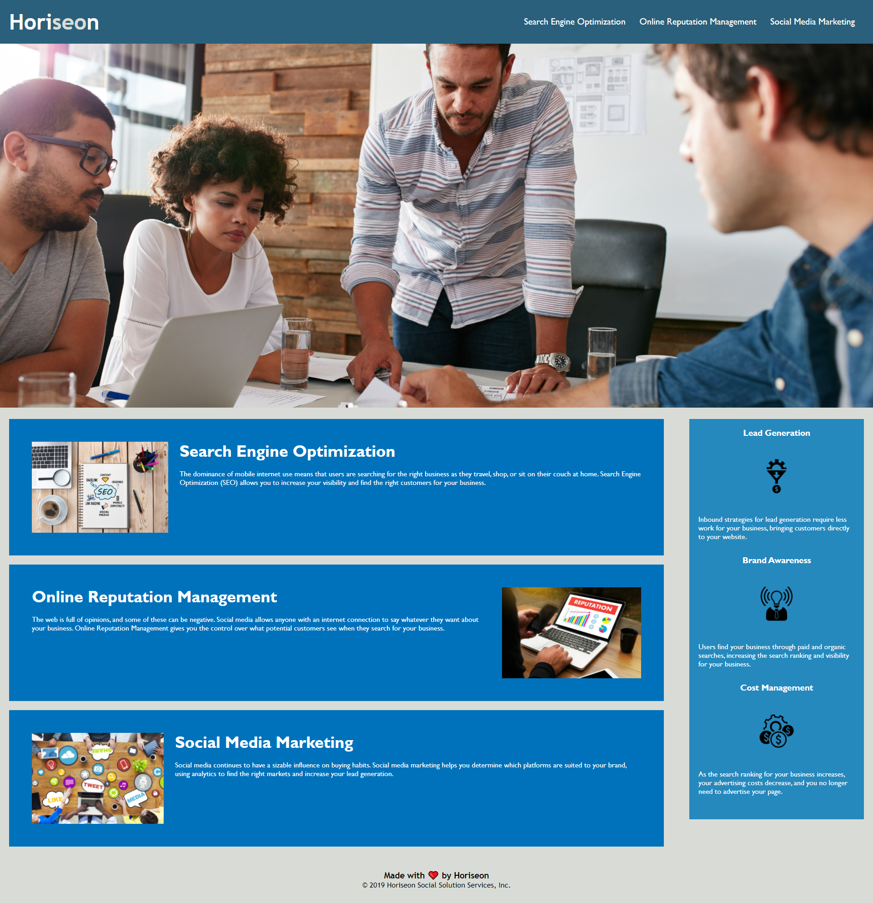

#  Horiseon Website Code Refactor
Refactored Horiseon Website that follows accessibility standards for search engine optimization.

## HTML Changes
In order for the site to be optimized for search engines, it needs a codebase that meets accessibility standards, which includes:

- Semantic HTML elements
- A logical structure of elements
- Accessible `alt` attributes for `` elements
- Sequential headings
- A succinct, descriptive title

### Semantic HTML Elements
In the original HTML, there was a great lack of semantic elements; only general elements like `<div>` were used. Screen readers would have a difficult time traversing through the code this way, so the solution would be to use semantic elements such as `<section>`, `<article>`, `<header>`, `<footer>`, and `<nav>` instead as shown below:

```html
 <section class="benefits">
        <article class="benefit-info">
            <h3>Lead Generation</h3>
            
            <p>
                Inbound strategies for lead generation require less work for your business, bringing customers directly to your website.
            </p>
        </article>
        <article class="benefit-info">
            <h3>Brand Awareness</h3>
            
            <p>
                Users find your business through paid and organic searches, increasing the search ranking and visibility for your business.
            </p>
        </article>
        <article class="benefit-info">
            <h3>Cost Management</h3>
            
            <p>
                As the search ranking for your business increases, your advertising costs decrease, and you no longer need to advertise your page.
            </p>
        </article>
    </section>

    <footer>
        <h3>Made with ❤️️ by Horiseon</h3>
        <p>
            &copy; 2019 Horiseon Social Solution Services, Inc.
        </p>
    </footer>
```

### Logical Structure of Elements
It wouldn't make sense for an `<article>` element to have a `<section>` element nested in it. A `<section>` should contain an `<article>` because articles are smaller and more specific than sections, just like how `<h1>` is more specific than `<header>`. This is how we maintain a logical structure in the code. Bigger elements contain the smaller, more specific elements, so that is how the new code is structured.

### Accessible `alt` Attributes for `` Elements
Images on a page may not be accessible to everyone, so there needs to be some way to gain information about the image if the image is not accessible. This is why `alt` attributes are important to include for all `` elements.

Instead of this:
```html

```

We should have this:
```html

```

Without that `alt` attribute, there is no way for some viewers to gain any information about the image, so it is important to always include it for every image.

### Sequential Headings
In the same vein as having a logical structure of elements, headings should also have a logical, sequential order. We wouldn't want an `<h1>` to be nested within an `<h3>`, nor would we want to jump from `<h2>` to `<h6>` without any other headings in between. The headings should come in sequential order: `<h1>`, `<h2>`, `<h3>`, and so on.

### A Succinct, Descriptive Title
Without a title, how would people know what site they are on or what kind of information is on it? This is why we should also include a `<title>` element within the `<head>` of the HTML:

```html
<head>
    <meta charset="UTF-8" />
    <link rel="stylesheet" href="./assets/css/style.css">
    <title>Horiseon</title>
</head>
```

## CSS Changes
After the accessibility of the HTML has been improved, the styles come next. While the website appears to look fine on the surface regarding the styling, a closer look at the CSS file reveals so much room for consolidation.




See the new [Horiseon site](https://kg-phantom.github.io/) for yourself!